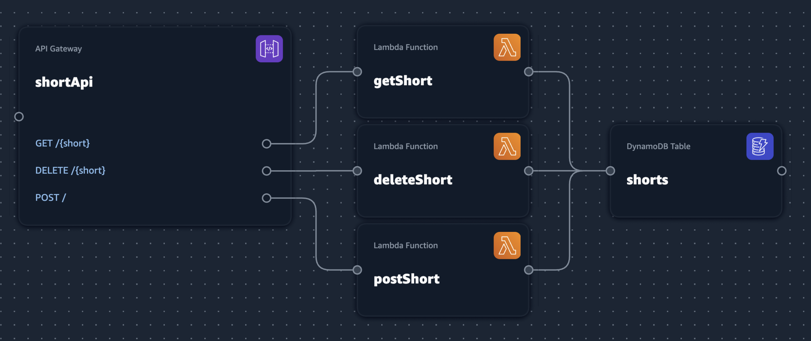

# Serverless URL Shortener

This project is meant to be a simple URL shortener project using Aws serverless components.

## Architecture

This project makes use of three core Aws services, Api Gateway, Lambda and DynamoDB.



Api Gateway is used as the ingress from the internet. It routes requests to get, create and delete shorts. Those requests are routing using [the Lambda Proxy integration](https://docs.aws.amazon.com/apigateway/latest/developerguide/set-up-lambda-proxy-integrations.html) which allows us to handle request and response data in Lambda rather than at the Api Gateway level.

There are three Lambda functions which are written for the Ruby 2.7 runtime. Each Lambda handles input processing, database access and responses to the client.

Finally, our data store is Aws DynamoDB which is used to store the mapping from short to full url using a single table.

## Deployment

This project made use of [Aws Application Composer](https://aws.amazon.com/application-composer/) to author an [Aws SAM template](./template.yaml). This template can then be deployed with the [SAM CLI](https://docs.aws.amazon.com/serverless-application-model/latest/developerguide/install-sam-cli.html#install-sam-cli-instructions) with the following command,

```bash
sam deploy -t ./template.yaml --parameter-overrides JwtSecret=${JWT_SECRET} CertIdentifier=${CERT_ID}
```
### Configuration

There are two required config values,

| Name | Desc |
|---|---|
| JwtSecret | A value used to identify the deletion token |
| CertIdentifier | The id, not arn, of a certificate for the custom domain of the api |